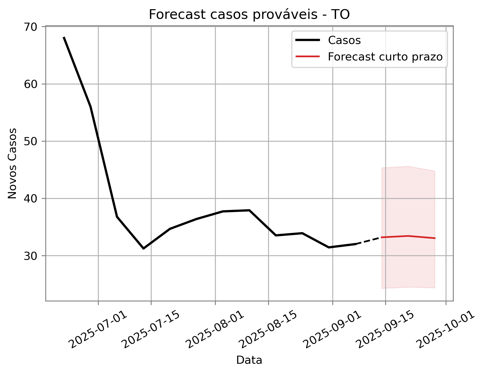
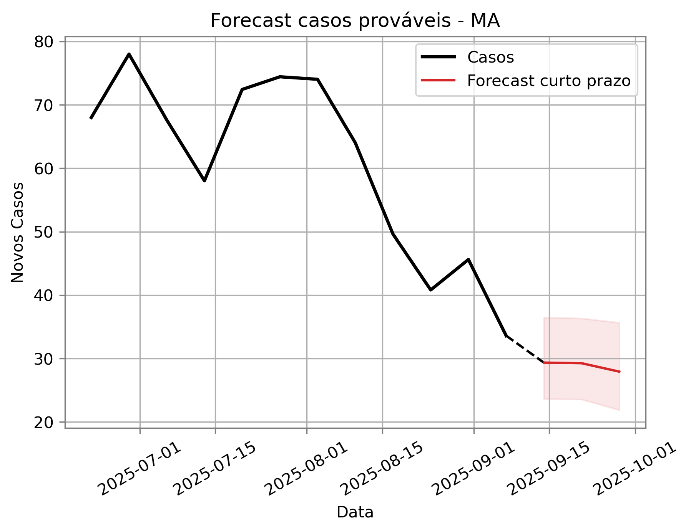
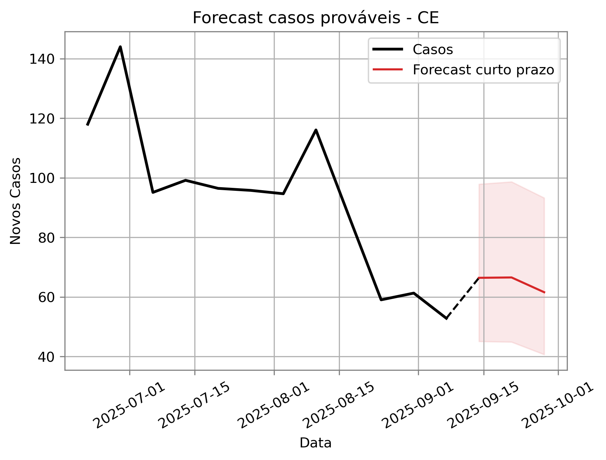
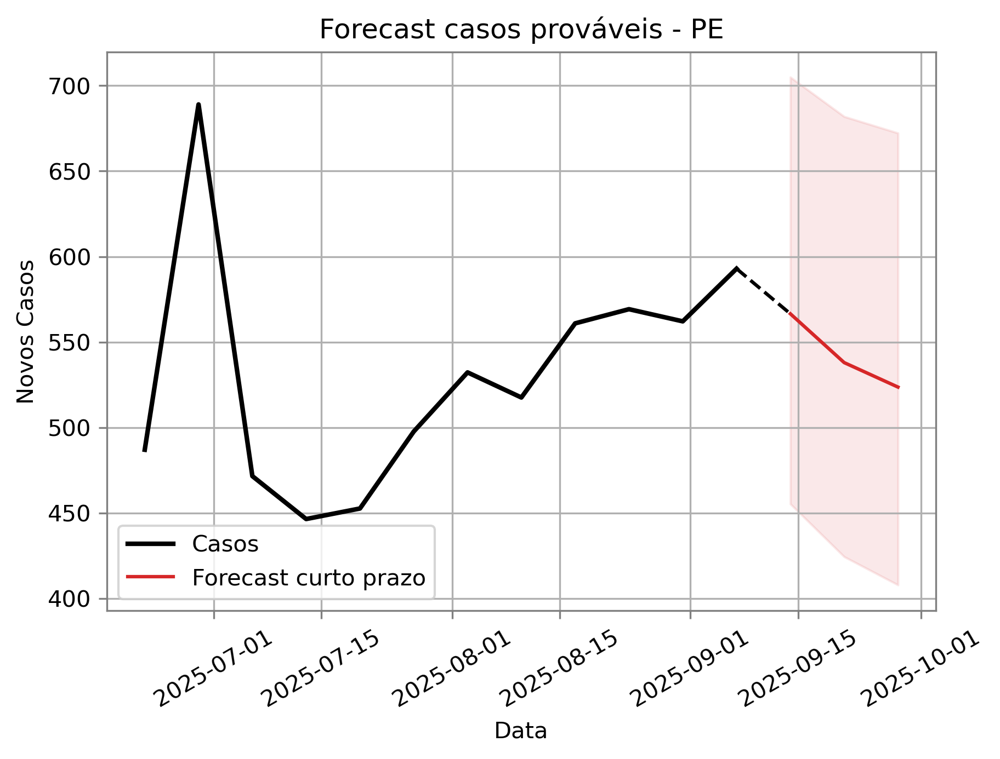
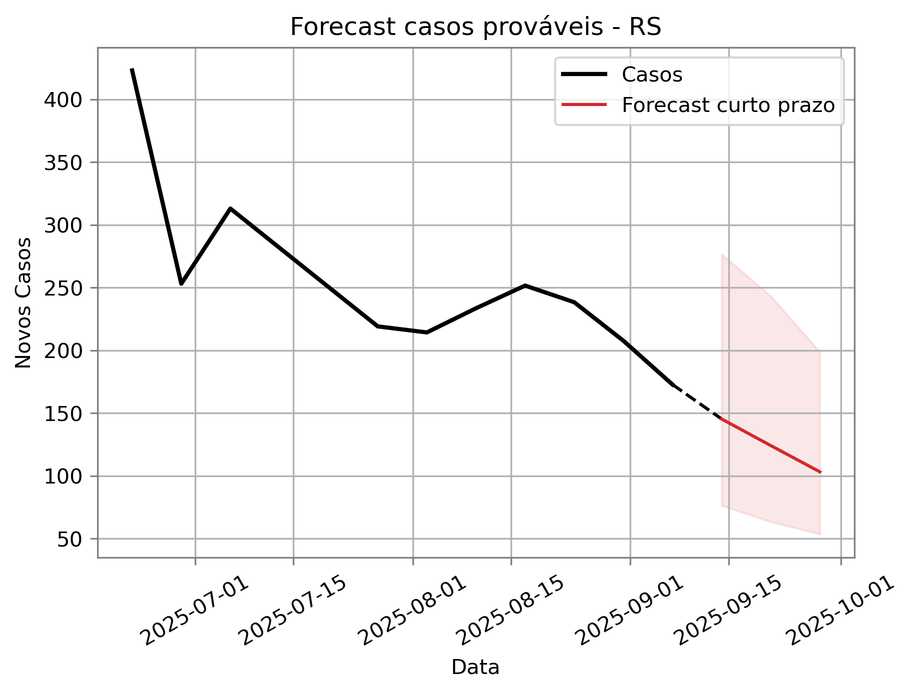
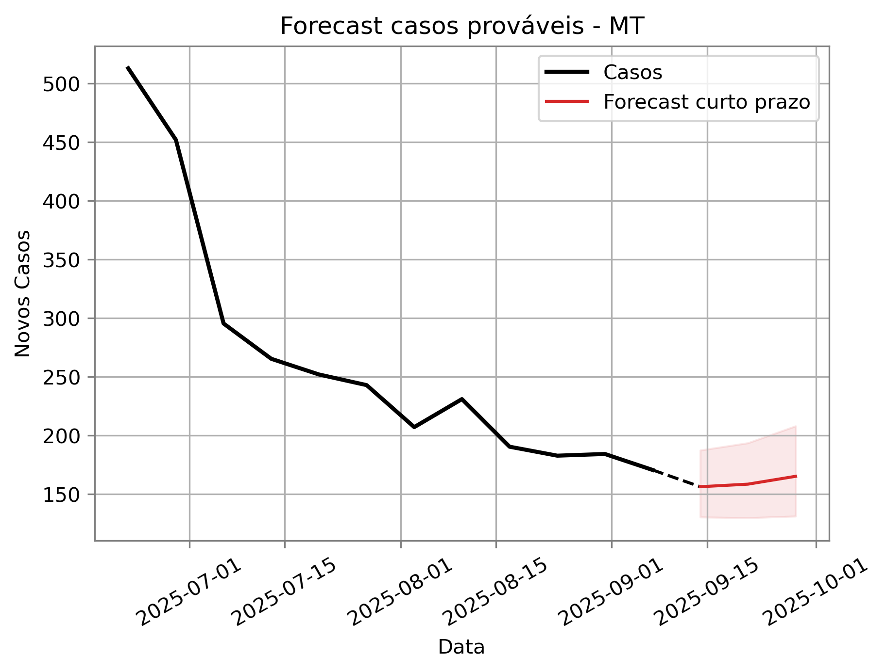
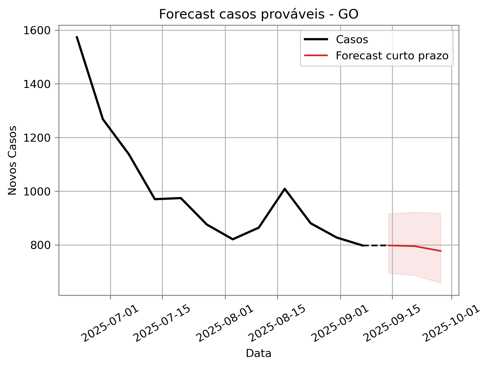

```{r, comment = "", setup, include = FALSE}
require(flextable)
require(officer)
library(glue)
knitr::opts_chunk$set(message = FALSE, echo = FALSE, 
                      dpi = 300, warning = FALSE)

options(knitr.duplicate.label = "allow")
options(scipen = 999999)

# Locale configurado para datas em português
Sys.setlocale("LC_TIME", "pt_BR.UTF-8")
```


```{r, include = FALSE}
df_dengue_nacional <- df_dengue_chik %>%
  filter(arbovirose == "Dengue") %>% 
  obter_metricas_nacionais() #Nacional

df_dengue_uf <- df_dengue_chik %>% # Por UF e SE
  filter(arbovirose == "Dengue") %>% 
  obter_metricas_estaduais() %>%
  mutate(
    ano = as.numeric(substr(SE, 1, 4)),
    semana = as.numeric(substr(SE, 5, 6))
  ) 

df_dengue_total <- df_dengue_chik %>% 
  filter(arbovirose == "Dengue") %>% 
  obter_metricas_estaduais_por_ano() # Estadual (por ano)

# Macroregional (por semana)
df_dengue_macro_se <- df_dengue_chik %>% 
  filter(arbovirose == "Dengue") %>% 
  obter_metricas_macrorregionais_por_semana() %>% 
  data.frame()

df_dengue_reg <- df_dengue_chik %>% 
  filter(arbovirose == "Dengue") %>% 
  obter_metricas_regionais_por_semana() %>% 
  obter_siglas_codigos(merge_by = "codigo") # Regional

tabela_dengue <- obter_tabela(
  df = df_dengue_chik %>% filter(arbovirose == "Dengue"),
  df_mem = memUFanual, 
  se_max_dengue
) # Tabela Estadual

df_dengue_regional_se <- df_dengue_reg %>% 
  filter(SE == se_max_dengue) %>%
  select(regional_id, codigo, pop, incest) %>% 
  mutate(regional_id = as.character(regional_id))

tabela_reg_dengue <- obter_metricas_por_regional(
  df_mem_regional_anual = memReganual,
  df_regional_se = df_dengue_regional_se
)

tabela_reg_dengue <- obter_classificacao_das_regionais(df_dengue_reg, tabela_reg_dengue)
tab_pop_risco_dengue <- tabela_reg_dengue %>% obter_pop_sob_risco()

shape_dengue <- shape %>%
  left_join(tabela_reg_dengue, by = "regional_id")

gg_pop_risco_dengue <- tab_pop_risco_dengue %>% 
  gg_bar_pop_risco(por_regiao = F)

gg_map_risco_classif_dengue <- obter_mapa_risco_classif(
  shape_mun = shape_dengue %>% 
    mutate(
      status = case_when(
        # is.na(status) ~ "Não se aplica",
        TRUE ~ status
      ),
      status = factor(status, levels = c("Alto em subida", "Alto estável", "Alto em queda", "Baixo ou moderado")) #, "Não se aplica"
    ),
  shape_state = shape_state
)

dengue_razao_anual <- df_dengue_chik %>% filter(arbovirose == "Dengue") %>% 
  mutate(
    ano = substr(SE, 1, 4),
    ano = as.numeric(ano)
  ) %>% 
  filter(ano >= max(ano, na.rm = T) - 4) %>% 
  group_by(ano) %>% 
  reframe(
    razao =  casos
  )
```


```{r, include = FALSE}
# Chikungunya
df_chik_nacional <- df_dengue_chik %>%
  filter(arbovirose == "Chikungunya") %>% 
  obter_metricas_nacionais() #Nacional

df_chik_uf <- df_dengue_chik %>% 
  filter(arbovirose == "Chikungunya") %>% 
  obter_metricas_estaduais() %>% 
  mutate(
    ano = as.numeric(substr(SE, 1, 4)),
    semana = as.numeric(substr(SE, 5, 6))
  )  # Estadual

df_chik_total <- df_dengue_chik %>% 
  filter(arbovirose == "Chikungunya") %>% 
  obter_metricas_estaduais_por_ano() # Estadual (por ano)

# Macroregional (por semana)
df_chik_macro_se <- df_dengue_chik %>% 
  filter(arbovirose == "Chikungunya") %>% 
  obter_metricas_macrorregionais_por_semana() %>% 
  data.frame()

df_chik_reg <- df_dengue_chik %>% 
  filter(arbovirose == "Chikungunya") %>% 
  obter_metricas_regionais_por_semana() %>% 
  obter_siglas_codigos(merge_by = "codigo") # Regional

tabela_chik <- obter_tabela(
  df = df_dengue_chik %>% filter(arbovirose == "Chikungunya"), 
  df_mem = memUFanual, se_max_chik
) # Tabela Estadual

df_chik_regional_se <- df_chik_reg %>% 
  filter(SE == se_max_chik) %>%
  select(regional_id, codigo, pop, incest) %>% 
  mutate(regional_id = as.character(regional_id))

tabela_reg_chik <- obter_metricas_por_regional(
  df_mem_regional_anual = memReganual.chi,
  df_regional_se = df_chik_regional_se
)

tabela_reg_chik <- obter_classificacao_das_regionais(df_chik_reg, tabela_reg_chik)
tab_pop_risco_chik <- tabela_reg_chik %>% obter_pop_sob_risco()

shape_chik <- shape %>%
  left_join(tabela_reg_chik, by = "regional_id")

gg_pop_risco_chik <- tab_pop_risco_chik %>% 
  gg_bar_pop_risco(por_regiao = T)

gg_map_risco_classif_chik <- obter_mapa_risco_classif(
  shape_mun = shape_chik %>% 
    mutate(
      status = case_when(
        # is.na(status) ~ "Não se aplica",
        TRUE ~ status
      ),
      status = factor(status, levels = c("Alto em subida", "Alto estável", "Alto em queda", "Baixo ou moderado")) #, "Não se aplica"
    ),
  shape_state = shape_state
)
```

```{r, include = FALSE}
# Informacoes textuais - dengue

# Ano selecionado
df_ano_selecionado_dengue <- df_dengue_chik %>% filter(arbovirose == "Dengue") %>% 
  filter(as.numeric(substr(SE, 1, 4)) == ano_selecionado) 

pop_brasil_ano_selecionado_dengue <- sum(df_ano_selecionado_dengue %>% 
                                           arrange(desc(SE)) %>% 
                                           dplyr::select(municipio_geocodigo, pop) %>% 
                                           distinct(municipio_geocodigo, .keep_all = T) %>% 
                                           pull(pop), na.rm = T)

total_casos_ano_selecionado_dengue <- sum(df_ano_selecionado_dengue %>% 
                                            pull(casos), na.rm = T)

total_casos_provaveis_ano_selecionado_dengue <- sum(df_ano_selecionado_dengue %>% 
                                                      pull(casprov), na.rm = T)

prop_casos_provaveis_dengue <- paste0(round(total_casos_provaveis_ano_selecionado_dengue/total_casos_ano_selecionado_dengue *100, 2),"%")

incidencia_acumulada_ano_selecionado_dengue <- total_casos_ano_selecionado_dengue/ pop_brasil_ano_selecionado_dengue * 10^5

# Ano anterior
df_ano_anterior_dengue <- df_dengue_chik %>% filter(arbovirose == "Dengue") %>% 
  filter(as.numeric(substr(SE, 1, 4)) == (ano_selecionado - 1))

pop_brasil_ano_anterior_dengue <- sum(df_ano_anterior_dengue %>% 
                                        arrange(desc(SE)) %>% 
                                        dplyr::select(municipio_geocodigo, pop) %>% 
                                        distinct(municipio_geocodigo, .keep_all = T) %>% 
                                        pull(pop), na.rm = T)

df_ano_anterior_dengue <- df_ano_anterior_dengue %>% 
  filter(SE <= (se_max_dengue - 100))

total_casos_ano_anterior_dengue <- sum(df_ano_anterior_dengue %>% 
                                         pull(casos), na.rm = T)
incidencia_acumulada_ano_anterior_dengue <- total_casos_ano_anterior_dengue/ pop_brasil_ano_anterior_dengue * 10^5

dif_prop_ano_dengue = total_casos_ano_selecionado_dengue/total_casos_ano_anterior_dengue
```

```{r, include = FALSE}
# Informacoes textuais - chikungunya

# Ano selecionado
df_ano_selecionado_chik <- df_dengue_chik %>% filter(arbovirose == "Chikungunya") %>% 
  filter(as.numeric(substr(SE, 1, 4))  == ano_selecionado) 

pop_brasil_ano_selecionado_chik <- sum(df_ano_selecionado_chik %>% 
                                         arrange(desc(SE)) %>% 
                                         dplyr::select(municipio_geocodigo, pop) %>% 
                                         distinct(municipio_geocodigo, .keep_all = T) %>% 
                                         pull(pop), na.rm = T)

total_casos_ano_selecionado_chik <- sum(df_ano_selecionado_chik %>% 
                                          pull(casos), na.rm = T)

total_casos_provaveis_ano_selecionado_chik <- sum(df_ano_selecionado_chik %>% pull(casprov), na.rm = T)

prop_casos_provaveis_chik <- paste0(round(total_casos_provaveis_ano_selecionado_chik/total_casos_ano_selecionado_chik *100, 2),"%")

incidencia_acumulada_ano_selecionado_chik <- total_casos_ano_selecionado_chik/ pop_brasil_ano_selecionado_chik * 10^5

# Ano anterior
df_ano_anterior_chik <- df_dengue_chik %>% filter(arbovirose == "Chikungunya") %>% 
  filter(as.numeric(substr(SE, 1, 4)) == (ano_selecionado - 1))

pop_brasil_ano_anterior_chik <- sum(df_ano_anterior_chik %>% 
                                      arrange(desc(SE)) %>% 
                                      dplyr::select(municipio_geocodigo, pop) %>% 
                                      distinct(municipio_geocodigo, .keep_all = T) %>% 
                                      pull(pop), na.rm = T)

df_ano_anterior_chik <- df_ano_anterior_chik %>% 
  filter(SE <= (se_max_chik - 100))

total_casos_ano_anterior_chik <- sum(df_ano_anterior_chik %>% 
                                       pull(casos), na.rm = T)
incidencia_acumulada_ano_anterior_chik <- total_casos_ano_anterior_chik/ pop_brasil_ano_anterior_chik * 10^5

dif_prop_ano_chik = total_casos_ano_selecionado_chik/total_casos_ano_anterior_chik
```


```{r, include = FALSE}
# Total
total_casos_ano_selecionado <- total_casos_ano_selecionado_dengue + total_casos_ano_selecionado_chik

total_casos_provaveis_ano_selecionado <- total_casos_provaveis_ano_selecionado_dengue + total_casos_provaveis_ano_selecionado_chik

prop_casos_provaveis_total <- paste0(round(((total_casos_provaveis_ano_selecionado)/(total_casos_ano_selecionado_dengue + total_casos_ano_selecionado_chik)) *100, 2),"%")

dif_prop_ano_total <- (total_casos_ano_selecionado_dengue + total_casos_ano_selecionado_chik)/(total_casos_ano_anterior_dengue + total_casos_ano_anterior_chik)

tab1 <- data.frame(
  agravo = c("Chikungunya", "Dengue", "Total"),
  casos_suspeitos = c(total_casos_ano_selecionado_chik, total_casos_ano_selecionado_dengue, total_casos_ano_selecionado),
  percentual_casos_suspeitos = c(prop_casos_provaveis_dengue, prop_casos_provaveis_chik, prop_casos_provaveis_total),
  var_relacao_ano_anterior = paste0(round(c(dif_prop_ano_chik, dif_prop_ano_dengue, dif_prop_ano_total)*100,2),"%")
) 

tabela_1 <- tab1 %>%
  set_names(
    c(
      "Doença", "Casos Registrados",
      "Porcentagem de Casos Prováveis",
      "Variação em relação ao Ano Passado")
  ) %>% 
  flextable() %>%
  theme_vanilla() %>%
  bold(part = "header") %>%
  align(align = "center", part = "all") %>%
  bg(bg = "#d1e2f2", part = "header") %>%
  color(color = "black", part = "header") %>%
  width(j = 1, width = 1.5) %>% 
  width(j = 2, width = 1.5) %>% 
  width(j = 3, width = 1.5) %>%   
  width(j = 4, width = 1.8)
```

```{r}
ultima_semana_dengue_formatado <- format(ultima_semana_fim, format = "%d/%m/%Y")

titulo_relatorio <- paste0("(Semana epidemiológica ", ultima_semana_dengue, ")")
```

```{r}
gerar_texto_boletim <- function(df_rt_dengue_br, df_rt_chik_br, shape_dengue, shape_chik) {
  
  # ---- TEXTO INTRODUTÓRIO ----
  dengue_rt_atual <- df_rt_dengue_br$Rt
  incidencia_atual <- round(df_rt_dengue_br$inc_est, 1)
  
  # Determinar o status baseado no Rt e incidência
  status_transmissao <- if (dengue_rt_atual < 1 && incidencia_atual < 20) {
    "encontra-se em patamar estável"
  } else if (dengue_rt_atual >= 1 && incidencia_atual < 50) {
    "apresenta sinais de crescimento"
  } else if (incidencia_atual >= 50) {
    "encontra-se em período epidêmico"
  } else {
    "apresenta comportamento moderado"
  }
  
  periodo_desc <- if (dengue_rt_atual < 1 && incidencia_atual < 20) {
    "Trata-se do período inter-epidêmico nacional da dengue."
  } else if (dengue_rt_atual >= 1) {
    "Observa-se tendência de crescimento da transmissão."
  } else {
    "O cenário requer monitoramento contínuo."
  }
  
  texto_intro <- glue(
    "- A notificação de dengue no país {status_transmissao} com um número reprodutivo de ",
    "{round(dengue_rt_atual, 2)} e uma incidência de notificação de dengue de aproximadamente ",
    "{incidencia_atual} casos por 100.000 habitantes por semana. {periodo_desc}"
  )
  
  # ---- DENGUE ----
  dengue_rt <- df_rt_dengue_br$Rt
  dengue_trend <- ifelse(dengue_rt > 1, "cresce", "diminui")
  dengue_range <- glue("{round(dengue_rt, 2)} [{round(df_rt_dengue_br$lwr, 2)}, {round(df_rt_dengue_br$upr, 2)}]")
  
  regioes_dengue_alta <- shape_dengue %>%
    filter(!is.na(status), status == "Alto" | status == "Muito alto") %>%
    distinct(regiao, sigla)
  
  texto_regioes_dengue <- if (nrow(regioes_dengue_alta) > 0) {
    regioes_str <- paste(unique(regioes_dengue_alta$sigla), collapse = ", ")
    glue("há um leve aumento de casos nas regiões {unique(regioes_dengue_alta$regiao)} ({regioes_str}).")
  } else {
    "não há sinais relevantes de aumento regional no momento."
  }
  
  texto_dengue <- glue(
    "- A notificação de dengue no país {dengue_trend} com um número reprodutivo de {dengue_range}. ",
    "Se esse {ifelse(dengue_rt > 1, 'crescimento', 'declínio')} se mantiver até as semanas 13 a 15 (pico típico no país), ",
    "podemos esperar entre 3,5 e 4,8 milhões de casos de dengue nessa temporada (semana 41 de 2024 a semana 40 de 2025). ",
    "A incidência por UF de dengue está baixa (< 20 por 100.000 hab), mas {texto_regioes_dengue} ",
    "Das {nrow(shape_dengue)} regionais analisadas, ",
    "a maioria tem casos abaixo do limiar (", sum(shape_dengue$nivel == 0, na.rm = TRUE), 
    "), mas ", sum(shape_dengue$nivel > 0, na.rm = TRUE), 
    " delas estão com alta incidência e em ascensão."
  )
  
  # ---- CHIKUNGUNYA ----
  chik_rt <- df_rt_chik_br$Rt
  chik_trend <- ifelse(chik_rt > 1, "cresce", "diminui")
  chik_range <- glue("{round(chik_rt, 2)} [{round(df_rt_chik_br$lwr, 2)}, {round(df_rt_chik_br$upr, 2)}]")
  
  regioes_chik_alta <- shape_chik %>%
    filter(!is.na(status), status == "Alto" | status == "Muito alto") %>%
    distinct(regiao, sigla)
  
  texto_regioes_chik <- if (nrow(regioes_chik_alta) > 0) {
    regioes_str <- paste(unique(regioes_chik_alta$sigla), collapse = ", ")
    glue("mostra alguns sinais de aumento nas regiões {unique(regioes_chik_alta$regiao)} ({regioes_str}).")
  } else {
    "não há sinais relevantes de aumento regional no momento."
  }
  
  texto_chik <- glue(
    "- Em relação à chikungunya, com número reprodutivo de {chik_range}, ",
    "estima-se entre 120 e 350 mil casos na temporada. ",
    "A incidência de chikungunya está baixa no geral (< 10 casos por 100.000 hab), mas {texto_regioes_chik} ",
    "Das {nrow(shape_chik)} regionais analisadas, ",
    "a maioria tem casos baixos, mas ", sum(shape_chik$nivel > 0, na.rm = TRUE),
    " estão com alta incidência e em crescimento."
  )
  
  glue("{texto_intro}\n\n{texto_dengue}\n\n{texto_chik}")
}
```

::: {custom-style="Centralizado e negrito"}
INFORME INFODENGUE

Informe da situação das arboviroses urbanas no Brasil

`r titulo_relatorio`

*Análises com base nos dados inseridos no SINAN ONLINE até o dia `r ultima_semana_dengue_formatado`.*  


**AVISOS:**
:::

::: {custom-style="Normal"}
Esse boletim analisa as condições de transmissão da chikungunya e dengue no Brasil utilizando dados de clima e notificação de casos fornecidos pela Secretaria de Vigilância em Saúde (SVS). A partir desses dados são analisadas as condições de receptividade climática, transmissão e incidência (ver definição), tendo como objetivo contribuir para a tomada de decisão na sala de situação.

Todas as análises do InfoDengue são baseadas nos casos notificados, sem excluir os casos descartados. Isso ocorre devido à grande heterogeneidade no descarte de casos e porque a análise visa ser oportuna, não sendo viável esperar pelo tempo necessário para os testes laboratoriais. Portanto, utiliza-se um sistema de nowcasting para a predição de dados.

Os dados provenientes dos sistemas de notificação de casos podem conter erros de digitação ou preenchimento, afetando um ou mais dos diversos campos de registro. Por isso, as notificações são constantemente avaliadas para correções necessárias, conforme a análise da rede de vigilância e das equipes locais responsáveis por cada registro.
:::

::: {custom-style="Centralizado e negrito"}
**CRÉDITOS:**  
:::

**Produção:** Equipe Infodengue.  

**Como citar:** Infodengue. `r titulo_relatorio`, PROCC/Fiocruz e EMap/FGV, `r ano_selecionado`.  

::: {custom-style="Normal"}
\newpage
### **PRINCIPAIS PONTOS EM DESTAQUE**  

```{r echo=FALSE, results='asis'}
texto_boletim <- gerar_texto_boletim_1(df_rt_dengue_br, df_rt_chik_br, shape_dengue, shape_chik)
texto_formatado <- gsub("\n", "\n\n", texto_boletim)
cat(texto_formatado)
```

### **Situação das Arboviroses no Brasil**  

Esse ano foram notificados até o momento, **`r prettyNum(total_casos_ano_selecionado, big.mark=".", decimal.mark = ",", scientific=FALSE)`** casos suspeitos de dengue e chikungunya, o que corresponde a uma incidência acumulada de **`r prettyNum(round(incidencia_acumulada_ano_selecionado_dengue, 0), big.mark=".", decimal.mark = ",", scientific=FALSE)`** casos de dengue e **`r prettyNum(round(incidencia_acumulada_ano_selecionado_chik, 0), big.mark=".", decimal.mark = ",", scientific=FALSE)`** casos de chikungunya por 100 mil habitantes.  

Para dengue, esse valor corresponde a **`r prettyNum(round(dif_prop_ano_dengue, 2), big.mark=".", decimal.mark = ",", scientific=FALSE)`** vezes o registrado no ano passado, enquanto para chikungunya, a **`r prettyNum(round(dif_prop_ano_chik, 2), big.mark=".", decimal.mark = ",", scientific=FALSE)`**.  

Do total de casos notificados, **`r prettyNum(total_casos_provaveis_ano_selecionado, big.mark=".", decimal.mark = ",", scientific=FALSE)`** foram classificados como prováveis até o momento. Isso é, **`r paste0(prettyNum(round(100 - total_casos_provaveis_ano_selecionado/total_casos_ano_selecionado *100, 2), big.mark=".", decimal.mark = ",", scientific=FALSE), "%")`** foi descartado.  

**Tabela 1.** Casos notificados de arboviroses até a semana `r ultima_semana_dengue`
:::

`r tabela_1`

\newline
### **Curvas de incidência e limiares epidêmicos para dengue e chikungunya no Brasil**

::: {custom-style="Normal"}
Nas figuras 1 e 2 estão apresentadas as curvas de incidências e seus limiares epidêmicos para o Brasil para dengue e chikungunya, respectivamente. A curva em **vermelho** indica a incidência estimada no ano atual até a semana `r ultima_semana_dengue`, enquanto a tracejada em **vermelho escuro** representa a incidência observada. A linha tracejada em **preto** indica o limiar de incidência muito alta.  

A curva de casos notificados de dengue segue mantendo tendência de aumento de casos desde a SE 44, acima dos canais endêmicos. Houve uma aceleração na notificação após as festividades de final de ano. O número reprodutivo encontra-se entre **1,4 e 1,7** (estava **1,3** no final de 2024). Se mantido esse crescimento, um total de casos de dengue entre **3,5 e 4,8 milhões** pode ser atingido durante essa temporada (ver explicações do método ao final do Informe).  

A curva de casos notificados de chikungunya também mostra tendência de aumento mais acelerado, passando de **Rt = 1,25** em dezembro, para **Rt entre 1,5 e 1,6** em janeiro. Com esse crescimento, um total de **120 a 350 mil casos** desse agravo podem vir a ser notificados na temporada atual.

```{r, fig.width = 12, fig.height = 5}
get_map_mem_incidencia_br(
  df_uf_inc = df_dengue_nacional,
  df_uf_mem = memBR_dengue_chik %>% filter(arbovirose == "Dengue"),
  df_limiar_mem = thresholds.tab,
  max_se = ultima_semana_dengue
)
```

**Figura 1.** Curvas de nowcasting para incidência de dengue até a semana epidemiológica `r ultima_semana_dengue` e limiares epidêmicos.

```{r, fig.width = 12, fig.height = 5}
get_map_mem_incidencia_br(
  df_uf_inc = df_chik_nacional,
  df_uf_mem = memBR_dengue_chik %>% filter(arbovirose == "Chikungunya"),
  df_limiar_mem = thresholds.tab,
  max_se = ultima_semana_chik
)
```

**Figura 2.** Curvas de nowcasting para incidência de chikungunya até a semana epidemiológica `r ultima_semana_chik` e limiares epidêmicos.
:::

## **Curvas de incidência e limiares epidêmicos para dengue por UF**

::: {custom-style="Normal"}
As curvas de incidência dos casos suspeitos notificados e os casos estimados de acordo com o nowcast, por estado, são apresentadas na figura 3. A curva em **vermelho** indica a incidência estimada no ano atual até a semana `r ultima_semana_dengue` enquanto a tracejada em **vermelho escuro** a incidência observada. A curva em **azul** exibe os valores observados em `r year(ultima_semana_inicio)-1`. A linha tracejada em **preto** indica o limiar de incidência muito alta.

Na região Norte,  chama atenção o Acre com tendência forte de crescimento, em discrepância com o padrão no ano passado, que já era de queda nessa semana. AP, AM e PA ultrapassaram o limiar epidêmico, estando em estado de alerta. Pará está com atividade acima da registrada no ano anterior.      

Na região Nordeste, todos estão abaixo do limiar epidêmico e as curvas de incidência estimada estão dentro ou próximas dos canais endêmicos. PB apresenta atividade acima do registrado no ano passado. 

No Centro-Oeste, MT está acima do limiar epidêmico e GO está próximo, gerando um alerta. Apenas MT está bem acima da incidência registrada no ano anterior. 

Na região Sudeste, todos os estados passaram do limiar epidêmico, estando em alerta. Dentre eles, SP chama atenção pela incidência mais alta do que em 2024, a qual já foi muito alta. 

No Sul, SC e RS mantêm-se acima do limiar epidêmico. Ambos apresentam notificação de casos menores que em 2024. O Paraná está abaixo do limiar epidêmico do estado, que é mais alto (55 casos por 100.000 hab), e segue com crescimento na incidência estimada, embora com valores bem mais baixos que 2024.

```{r, fig.width = 11, fig.height = 12}
get_map_mem_incidencia(
  df_uf_inc = df_dengue_uf,
  df_uf_mem = memUFsazonal,
  df_limiar_mem = memUFanual,
  max_se = ultima_semana_dengue,
  se_ahead = 0
)
```

**Figura 3.** Curvas de incidência e limiares epidêmicos para dengue até a semana epidemiológica `r ultima_semana_dengue`.
:::

## Curvas de incidência e limiares epidêmicos para chikungunya por UF

::: {custom-style="Normal"}
Na figura 4 são exibidas, por estado, as curvas de incidência dos casos suspeitos notificados e os casos estimados de acordo com o nowcast. A curva em **vermelho** indica a incidência estimada no ano atual até a semana `r ultima_semana_dengue` enquanto a tracejada em **vermelho escuro** a incidência observada. A curva em **azul** exibe os valores observados em `r year(ultima_semana_inicio)-1`. A linha tracejada em **preto** indica o limiar de incidência muito alta.

No Norte, os modelos indicam um aumento rápido de notificação de chikungunya no AP e, mais lento, no AC. 

No Nordeste, a notificação desse agravo encontra-se baixa para a época.

No Centro-Oeste, MT, MS e GO estão com notificação acima do limiar epidêmico, com forte tendência de subida em MT e MS. 

No Sudeste, observa-se SP e MG com notificação acima do limiar epidêmico e tendência de aumento.

No Sul, o Paraná entra em alerta, com notificação acima do limiar epidêmico.

```{r, fig.width = 11, fig.height = 12}
get_map_mem_incidencia(
  df_uf_inc = df_chik_uf,
  df_uf_mem = memUFsazonal.chi,
  df_limiar_mem = memUFanual.chi,
  max_se = ultima_semana_chik
)
```

**Figura 4.** Curvas de incidência e limiares epidêmicos para chikungunya até a semana epidemiológica `r ultima_semana_chik`.
:::

## **Picos de incidências por UF**

::: {custom-style="Normal"}
Na figura 5 e 6 estão representadas os picos das incidências anuais de dengue e chikungunya, por unidade da federação. Os pontos **cinzas** indicam os picos para os anos anteriores (2010 a `r year(ultima_semana_inicio)-1`), o ponto **vermelho** indica o pico em `r year(ultima_semana_inicio)` e o ponto **laranja** a incidência na semana `r ultima_semana_dengue`.

```{r}
df_dengue_chik_estados <- df_dengue_chik %>% 
  dplyr::select(arbovirose, SE, municipio_geocodigo, casos, pop) %>%
  mutate(
    arbovirose = factor(arbovirose, levels = c("Dengue", "Chikungunya")),
    ano = substr(SE, 1, 4),
    municipio_geocodigo = substr(municipio_geocodigo, 1, 2),
    municipio_geocodigo = as.character(municipio_geocodigo)
  ) %>% 
  rename(codigo = municipio_geocodigo) 

df_pop <- df_dengue_chik_estados %>% 
  filter(arbovirose == "Dengue") %>% 
  dplyr::select(codigo, ano, pop) %>% 
  group_by(codigo, ano) %>% 
  reframe(
    pop = sum(pop, na.rm = T)
  ) %>% 
  mutate(
    id = paste(codigo, ano, sep = "_")
  ) %>% 
  dplyr::select(-c(codigo, ano))

df_dengue_chik_estados_casos <- df_dengue_chik_estados %>% 
  group_by(arbovirose, codigo, ano) %>% 
  reframe(
    casos = sum(casos, na.rm = T)
  ) %>% 
  mutate(
    id = paste(codigo, ano, sep = "_")
  ) %>% 
  mutate(
    ano = as.numeric(ano),
    grupo = ifelse(ano ==  max(ano), max(ano), paste0(min(ano),"-",max(ano)-1))
  ) 

df_dengue_chik_estados_casos_atual <- df_dengue_chik_estados %>% 
  filter(SE == max(se_max_dengue, se_max_chik)) %>% 
  group_by(arbovirose, codigo, ano) %>% 
  reframe(
    casos = sum(casos, na.rm = T)
  )  %>% 
  mutate(
    id = paste(codigo, ano, sep = "_"),
    ano = as.numeric(ano),
    grupo = "Semana\natual"
  ) 

df_dengue_chik_estados <- df_dengue_chik_estados_casos %>% 
  bind_rows(df_dengue_chik_estados_casos_atual) %>% 
  left_join(df_pop, by = "id") %>% 
  mutate(
    inc = casos/pop * 100000
  ) %>% 
  mutate(
    grupo = factor(grupo, 
                   levels = c(
                     paste0(min(ano),"-",max(ano)-1),
                     max(ano), 
                     "Semana\natual")
    )
  ) %>% 
  obter_siglas_codigos() 

df_dengue_chik_estados$estado <-  stringi::stri_unescape_unicode(df_dengue_chik_estados$estado)

semana_epidemica_dengue_chik_estados <- df_dengue_chik_estados %>% 
  group_by(arbovirose, sigla) %>% 
  filter(ano == max(ano, na.rm = T)) %>% 
  filter(inc == max(inc, na.rm = T)) %>% 
  dplyr::select(sigla, grupo) %>% 
  ungroup()
```


```{r}
dengue_semana_epidemica_estados <- semana_epidemica_dengue_chik_estados %>% 
  filter(arbovirose == "Dengue") %>% 
  filter(grupo == "Semana\natual") %>% 
  pull(sigla)

frase_dengue_1 <- texto_1(dengue_semana_epidemica_estados, arbovirose = "dengue")
```

`r frase_dengue_1`

```{r, fig.width = 12, fig.height = 4}
df_dengue_chik_estados %>% 
  filter(arbovirose == "Dengue") %>% 
  gg_timeline_dots()
```

**Figura 5.** Pico da incidência por 100 mil habitantes sobre os casos notificados de dengue até a semana `r ultima_semana_dengue`.

```{r}
chik_semana_epidemica_estados <- semana_epidemica_dengue_chik_estados %>% 
  filter(arbovirose == "Chikungunya") %>% 
  filter(grupo == "Semana\natual") %>% 
  pull(sigla)

frase_chik_1 <- texto_1(chik_semana_epidemica_estados, arbovirose = "chikungunya")
```

`r frase_chik_1`

```{r, fig.width = 12, fig.height = 4}
df_dengue_chik_estados %>% 
  filter(arbovirose == "Chikungunya") %>% 
  gg_timeline_dots()
```

**Figura 6.** Pico da incidência por 100 mil habitantes sobre os casos notificados de chikungunya até a semana `r ultima_semana_dengue`.
:::

## **Análise de tendência de crescimento de casos de dengue**

::: {custom-style="Normal"}
A tabela 2 apresenta um panorama sobre a tendência da incidência de dengue para casos notificados e estimados em todo o país até a semana `r ultima_semana_dengue`. As **setas** indicam se os casos estão crescendo ou decrescendo significativamente.

**Norte:** Quase todos os estados, com exceção de RO e RR, estão com crescimento de notificação. As maiores taxas de aumento são registradas no AC e PA.  

**Nordeste:** Quase todos os estados com tendência de crescimento de notificação, ainda que as incidências estejam baixas.  

**Centro-Oeste:** Todos em crescimento de notificação, com exceção de MS. Os maiores valores de Rt são registrados em MT (Rt = 1,62), onde o crescimento está concentrado nas regiões Centro-Noroeste e Sul. DF está com leve crescimento (Rt = 1,13).

**Sudeste:** Todos os estados com tendência de aumento de notificação, com Rt variando de 1.4 (RJ) a 1.59 (MG).  Em SP, muitas regiões de saúde estão com crescimento acima da média, chamando atenção para RRAS 13, com Rt = 1,9. Em MG, esse nível de crescimento é observado nas regiões Nordeste e Sudeste. ES com dados incompletos. 

**Sul:** Todos os estados estavam com número reprodutivo maior que 1, porém de crescimento mais leve que a média nacional. O maior valor ocorreu no PR (Rt = 1,32). Já SC e RS estão com Rt abaixo de 1,2. 
:::

**Tabela 2.** Situação dos estados em relação à notificação dos casos de dengue em `r year(ultima_semana_inicio)`.
```{r}
tabela_dengue_uf <- memUFanual %>%
  left_join(df_dengue_uf %>% 
              filter(SE == max(SE, na.rm = T)) %>% 
              select(codigo, incest, inc) %>% 
              mutate(codigo = as.character(codigo)),
            by = "codigo") %>% 
  mutate(
    nivelNowcast = as.numeric(incest > (2 * veryhigh)),
    Rtmean = NA,
    secomp1 = NA,
    weekmax = NA
  )

tabela_dengue_uf <- map_dfr(
  unique(df_dengue_uf$codigo),
  obter_rt_por_uf,
  df_uf = df_dengue_uf,
  tabela_uf = tabela_dengue_uf
)

tabela_chik_uf <- memUFanual.chi %>%
  left_join(df_chik_uf %>% 
              filter(SE == max(SE, na.rm = T)) %>% 
              select(codigo, incest, inc) %>% 
              mutate(codigo = as.character(codigo)),
            by = "codigo") %>% 
  mutate(
    nivelNowcast = as.numeric(incest > (2 * veryhigh)),
    Rtmean = NA,
    secomp1 = NA,
    weekmax = NA
  )

tabela_chik_uf <- map_dfr(
  unique(df_chik_uf$codigo),
  obter_rt_por_uf,
  df_uf = df_chik_uf,
  tabela_uf = tabela_chik_uf
)

tabela_rt_dengue_chik_uf <- tabela_dengue_uf %>% 
  mutate(arbovirose = "Dengue") %>% 
  bind_rows(tabela_chik_uf %>% 
              mutate(arbovirose = "Chikungunya"))

# %>% 
#   filter(tendencia %in% c("Crescente", "Crescente leve")) %>% 
#   mutate(
#     arbovirose = factor(arbovirose, levels = c("Dengue", "Chikungunya"))
#   ) %>% 
#   dplyr::select(
#     regiao,
#     arbovirose,
#     estado,
#     Rtmean,
#     # status,
#     tendencia
#   )
```


```{r}
tabela_tendencia_por_uf_inc_observada_dengue <- df_dengue_uf %>% 
  construir_tabela_incidencia_por_semana(var = "inc")

tabela_tendencia_por_uf_inc_estimada_dengue <- df_dengue_uf %>% 
  construir_tabela_incidencia_por_semana(var = "incest")

# tabela_tendencia_por_uf_inc_observada_dengue <- verificar_tendencia_regressao(tabela_tendencia_por_uf_inc_observada_dengue)
# 
# tabela_tendencia_por_uf_inc_estimada_dengue <- verificar_tendencia_regressao(tabela_tendencia_por_uf_inc_estimada_dengue)

tabela_tendencia_por_uf_inc_observada_dengue <- tabela_tendencia_por_uf_inc_observada_dengue %>% 
  obter_siglas_codigos() %>% 
  relocate(regiao, .before = codigo) %>% 
  relocate(sigla, .after = regiao) %>% 
  as_tibble() %>% 
  dplyr::select(-c(codigo, estado))

tabela_tendencia_por_uf_inc_estimada_dengue <- tabela_tendencia_por_uf_inc_estimada_dengue %>% 
  obter_siglas_codigos() %>% 
  relocate(regiao, .before = codigo) %>% 
  relocate(sigla, .after = regiao) %>% 
  as_tibble() %>% 
  dplyr::select(-c(codigo, estado))

inc_obs_max_dengue <- ceiling(max(tabela_tendencia_por_uf_inc_observada_dengue[3:6], na.rm = T))
inc_est_max_dengue <- ceiling(max(tabela_tendencia_por_uf_inc_estimada_dengue[3:6], na.rm = T))
```


```{r}
tab_tendencia_por_uf_inc_observada_dengue <- tabela_tendencia_por_uf_inc_observada_dengue %>% 
  left_join(tabela_rt_dengue_chik_uf %>% 
              filter(arbovirose == "Dengue") %>% 
              dplyr::select(sigla, Rtmean),
            by = "sigla") %>% 
  mutate(
    Rtmean = round(Rtmean, 2),
    tendencia = add_arrows(Rtmean, ref = 1)
  ) %>% 
  relocate(Rtmean, .after = sigla) %>% 
  relocate(tendencia, .after = Rtmean) %>% 
  bind_cols(tabela_tendencia_por_uf_inc_estimada_dengue %>% 
              dplyr::select(-c(regiao, sigla))) %>% 
  gerar_tabela_tendencia_flextable(inc_obs_max = inc_obs_max_dengue, inc_est_max = inc_est_max_dengue)

tab_tendencia_por_uf_inc_observada_dengue
```

```{r, include = FALSE}
n_regionais_incidencia_dengue_alto_em_subida <- shape_dengue %>% filter(status == "Alto em subida") %>% pull() %>% length()

n_regionais_incidencia_dengue_alto_estavel <- shape_dengue %>% filter(status == "Alto estavel") %>% pull() %>% length()

n_regionais_incidencia_dengue_alto_em_queda <- shape_dengue %>% filter(status == "Alto em queda") %>% pull() %>% length()

n_regionais_incidencia_dengue_baixo <- shape_dengue %>% filter(status == "Baixo ou moderado") %>% pull() %>% length()
```

::: {custom-style="Normal"}
De acordo com a figura 7, do total de 450 regionais, `r n_regionais_incidencia_dengue_alto_em_subida` estão com alta incidência e continuam subindo, `r n_regionais_incidencia_dengue_alto_estavel` estão com alta, porém estável, `r n_regionais_incidencia_dengue_alto_em_queda` estão com alta, mas em queda e `r n_regionais_incidencia_dengue_baixo` estão com baixa ou moderada incidência de dengue.

```{r, fig.width = 12, fig.height = 12}
gg_map_risco_classif_dengue
```

**Figura 7.** Regionais de saúde que a incidência de dengue esta em tendência de alta em subida (vermelho), alto estável (laranja), alto em queda (amarelo) e baixo ou moderado (verde).
:::

## **Análise de tendência de crescimento de casos de chikungunya**

::: {custom-style="Normal"}
A tabela 3 apresenta um panorama sobre a tendência da incidência de chikungunya para casos notificados e estimados em todo o país até a semana `r ultima_semana_chik`. As **setas** indicam se os casos estão crescendo ou decrescendo significativamente.

**Norte:** Todos os estados, exceto RO e AM, estão com número reprodutivo acima de 1. Dentre esses, chama atenção um potencial aumento no Amapá. O AC encontra-se em atenção também pois todas as regionais estão com alta notificação.

**Nordeste:** Alguns estados com crescimento moderado (CE, RN, MA). Considerando as baixas incidências, não reconhecemos como preocupação por enquanto. 

**Centro-Oeste:** Dois estados com as maiores taxas de crescimento do país, MS e MT, com Rt acima de 2. GO e DF também com expectativa de crescimento, mas mais moderado. Em MT, o crescimento está concentrado nas regiões Centro-Noroeste e Sul.  

**Sudeste:** Todos os estados com Rt maior que 1, com maiores taxas em SP e MG, com Rt = 1,4 e 1,6, respectivamente. 

**Sul:** Apenas PR com número reprodutivo moderado (Rt = 1,3).
:::

\newpage
**Tabela 3.** Situação dos estados em relação à notificação dos casos de chikungunya em `r year(ultima_semana_inicio)`.
```{r}
tabela_tendencia_por_uf_inc_observada_chik <- df_chik_uf %>% 
  construir_tabela_incidencia_por_semana(var = "inc")

tabela_tendencia_por_uf_inc_estimada_chik <- df_chik_uf %>% 
  construir_tabela_incidencia_por_semana(var = "incest")

# tabela_tendencia_por_uf_inc_observada_chik <- verificar_tendencia_regressao(tabela_tendencia_por_uf_inc_observada_chik)
# 
# tabela_tendencia_por_uf_inc_estimada_chik <- verificar_tendencia_regressao(tabela_tendencia_por_uf_inc_estimada_chik)

tabela_tendencia_por_uf_inc_observada_chik <- tabela_tendencia_por_uf_inc_observada_chik %>% 
  obter_siglas_codigos() %>% 
  relocate(regiao, .before = codigo) %>% 
  relocate(sigla, .after = regiao) %>% 
  as_tibble() %>% 
  dplyr::select(-c(codigo, estado))

tabela_tendencia_por_uf_inc_estimada_chik <- tabela_tendencia_por_uf_inc_estimada_chik %>% 
  obter_siglas_codigos() %>% 
  relocate(regiao, .before = codigo) %>% 
  relocate(sigla, .after = regiao) %>% 
  as_tibble() %>% 
  dplyr::select(-c(codigo, estado))

inc_obs_max_chik <- ceiling(max(tabela_tendencia_por_uf_inc_observada_chik[3:6], na.rm = T))
inc_est_max_chik <- ceiling(max(tabela_tendencia_por_uf_inc_estimada_chik[3:6], na.rm = T))
```


```{r}
tab_tendencia_por_uf_inc_observada_chik <-  tabela_tendencia_por_uf_inc_observada_chik %>% 
  left_join(tabela_rt_dengue_chik_uf %>% 
              filter(arbovirose == "Chikungunya") %>% 
              dplyr::select(sigla, Rtmean),
            by = "sigla") %>% 
  mutate(
    Rtmean = round(Rtmean, 2),
    tendencia = add_arrows(Rtmean, ref = 1)
  ) %>% 
  relocate(Rtmean, .after = sigla) %>% 
  relocate(tendencia, .after = Rtmean) %>% 
  bind_cols(tabela_tendencia_por_uf_inc_estimada_chik %>% 
              dplyr::select(-c(regiao, sigla))) %>% 
  gerar_tabela_tendencia_flextable(inc_obs_max = inc_obs_max_chik, inc_est_max = inc_est_max_chik)

tab_tendencia_por_uf_inc_observada_chik
```

```{r, include = FALSE}
n_regionais_incidencia_chik_alto_em_subida <- shape_chik %>% filter(status == "Alto em subida") %>% pull() %>% length()

n_regionais_incidencia_chik_alto_estavel <- shape_chik %>% filter(status == "Alto estavel") %>% pull() %>% length()

n_regionais_incidencia_chik_alto_em_queda <- shape_chik %>% filter(status == "Alto em queda") %>% pull() %>% length()

n_regionais_incidencia_chik_baixo <- shape_chik %>% filter(status == "Baixo ou moderado") %>% pull() %>% length()
```

::: {custom-style="Normal"}
Conforme a figura 8, do total de 450 regionais, `r n_regionais_incidencia_chik_alto_em_subida` estão com alta incidência e continuam subindo, `r n_regionais_incidencia_chik_alto_estavel` estão com alta, porém estável, `r n_regionais_incidencia_chik_alto_em_queda` estão com alta, mas em queda e `r n_regionais_incidencia_chik_baixo` estão com baixa ou moderada incidência de chikungunya.

```{r, fig.width = 12, fig.height = 14}
gg_map_risco_classif_chik
```

**Figura 8.** Regionais de saúde que a incidência de chikungunya esta em tendência de alta em subida (vermelho), alto estável (laranja), alto em queda (amarelo) e baixo ou moderado (verde).
:::

## **Comparação da incidência atual de dengue por UF com as previstas pelos modelos de previsão de temporada**

::: {custom-style="Normal"}
O Infodengue, em parceria com o Mosqlimate, gerou previsões para a temporada 2024-2025 de dengue no país, por UF (https://zenodo.org/records/13929005).

A temporada é definida como o período entre a semana 41 de 2024 e a semana 40 de 2025. A Figura abaixo mostra a incidência esperada de casos de dengue (casos prováveis). Para cada estado, tem-se dois modelos ensemble, que representam cenários de maior ou menor incidência esperada.

O modelo ensemble 23 foi calibrado com o cenário epidemiológico de 2023, enquanto que o modelo 24 é calibrado para o cenário epidemiológico 2024. Para a maioria das UFs, o modelo de 2024 tem predições de maior magnitude. Para interpretação, recomendamos trabalhar com os dois modelos como cenários alternativos. 

A figura abaixo mostra o esperado para toda a temporada, de acordo com cada modelo: (A) incidência acumulada de casos prováveis de dengue em toda a temporada, segundo o modelo 2023; (B) o mesmo, considerando o modelo 2024; (C)  cada faixa vertical liga os valores médios de cada modelo. Medidas de incerteza não são mostradas nessa figura. Observa-se que os modelos indicam um ano epidêmico (> 300 casos por 100.000 hab) na maioria dos estados. Contudo os valores previstos de incidência são menores do que os observados em 2024, na maioria dos estados (https://zenodo.org/records/13929005).

```{r, fig.width = 12, fig.height = 14}
combined_plots123
```

**Figura 9.** Previsão para a temporada 2024/25.

A figura abaixo mostra o número de casos prováveis e a incidência acumulada estimada de dengue (casos prováveis) desde o início da temporada, isso é, semana `r ultima_semana_dengue` até a atual.  Para o cálculo dos casos prováveis, aplica-se um fator de correção aos casos totais notificados. O fator é calculado com base na proporção de definidos como casos prováveis nos últimos seis meses, excluindo-se as últimas dez semanas. Além disso, a incidência estimada é corrigida utilizando nowcast. 

Observa-se que, em termos absolutos, a maior frequência de casos na temporada foi registrada no estado de SP, seguido de PR, SC e GO, um padrão que se mantém nas últimas semanas (Fig A).  Em termos relativos à população, o maior risco está concentrado no AC, AP, além dos acima mencionados. A Figura C compara a incidência acumulada até o momento com o previsto pelos modelos ensemble. Em quase todos, a incidência está menor ou dentro do previsto. As exceções são:  AP e DF que estão acima do esperado, mas dentro da faixa de incerteza dos modelos.  

```{r, fig.width = 12, fig.height = 14}
combined_plots456
```

**Figura 10.** (A) Número estimado de casos prováveis, (B) incidência acumulada; e (C) Casos prováveis estimados de dengue.
:::

## **Previsão para as próximas 3 semanas**

::: {custom-style="Normal"}
Para gerar predições de curto prazo, são treinados semanalmente três modelos de predição: o primeiro é baseado em redes neurais LSTM, o segundo utiliza processos gaussianos, e o último é um modelo ARIMA não sazonal e univariado. Esses modelos foram aplicados aos casos prováveis a nível de Unidade da Federação (UF) no Brasil, sendo treinado um modelo para cada UF e outro para o Brasil como um todo.

A figura 11 mostra as previsões para as próximas 3 semanas. Em termos de incidência, o maior risco encontra-se em SP e MG, seguido de GO, MT, RJ. Em termos de total de casos no período (Fig B), espera-se menos do que o previsto nos modelos ensembles de temporada, em 15 dos 27 estados (pontos azuis). Os demais estados aparecem com estimativas entre o esperado pelos dois forecasts, sendo que AP, AC, PA estão um pouco acima do esperado, mas ainda dentro da faixa de incerteza.  

```{r, fig.width = 12, fig.height = 14}
combined_plot78
```

**Figura 11.** Previsões para as próximas 3 semanas.

As figuras abaixo mostram as curvas de incidência observadas e preditas para cada UF. O painel à esquerda apresenta um zoom com o objetivo de destacar as previsões de curto prazo, enquanto o painel à direita foca em comparar a tendência de curto prazo prevista com as tendências projetadas pelos modelos de ensemble de longo prazo propostos. Importante ressaltar que a figura à esquerda representa um “zoom” da imagem à direita.
:::

# Norte
```{r, fig.pos='center'}   
knitr::include_graphics("figures/forecast_RO.png")  
knitr::include_graphics("figures/forecast_AC.png")  
knitr::include_graphics("figures/forecast_AM.png")  
  
  
knitr::include_graphics("figures/forecast_AP.png")  
  
```

# Nordeste
```{r, fig.pos='center'}   
  
knitr::include_graphics("figures/forecast_PI.png")  
  
knitr::include_graphics("figures/forecast_RN.png")  
  
  
knitr::include_graphics("figures/forecast_AL.png")  
knitr::include_graphics("figures/forecast_SE.png")  
knitr::include_graphics("figures/forecast_BA.png")  
```

# Sudeste
```{r, fig.pos='center'}   
knitr::include_graphics("figures/forecast_MG.png")  
knitr::include_graphics("figures/forecast_RJ.png")  
knitr::include_graphics("figures/forecast_SP.png")  
```

# Sul
```{r, fig.pos='center'}   
knitr::include_graphics("figures/forecast_PR.png")  
knitr::include_graphics("figures/forecast_SC.png")  
  
```

# Centro-Oeste

```{r, fig.pos='center'}    
knitr::include_graphics("figures/forecast_MS.png")  
  
  
knitr::include_graphics("figures/forecast_DF.png")
```

**Alguns detalhes por macroregião:**

::: {custom-style="Normal"}
A tabela a seguir mostra as macrorregiões que apresentaram tendência de crescimento do número de casos (Rt médio maior ou igual a 1,1).

```{r}
tabela_dengue_macro <- memMacroanual %>%
  left_join(df_dengue_macro_se %>% 
              filter(SE == max(SE, na.rm = T)) %>% 
              select(macroregional_id, incest, inc) %>% 
              mutate(macroregional_id = as.character(macroregional_id)),
            by = "macroregional_id") %>% 
  mutate(
    nivelNowcast = as.numeric(incest > (2 * veryhigh)),
    Rtmean = NA,
    secomp1 = NA,
    weekmax = NA
  )

tabela_dengue_macro <- map_dfr(
  unique(df_dengue_macro_se$macroregional_id),
  obter_rt_por_macroregiao,
  df_macro = df_dengue_macro_se,
  tabela_macro = tabela_dengue_macro
)

tabela_chik_macro <- memMacroanual.chi %>%
  left_join(df_chik_macro_se %>% 
              filter(SE == max(SE, na.rm = T)) %>% 
              select(macroregional_id, incest, inc) %>% 
              mutate(macroregional_id = as.character(macroregional_id)),
            by = "macroregional_id") %>% 
  mutate(
    nivelNowcast = as.numeric(incest > (2 * veryhigh)),
    Rtmean = NA,
    secomp1 = NA,
    weekmax = NA
  )

tabela_chik_macro <- map_dfr(
  unique(df_chik_macro_se$macroregional_id),
  obter_rt_por_macroregiao,
  df_macro = df_chik_macro_se,
  tabela_macro = tabela_chik_macro
)

tabela_dengue_chik_macro <- tabela_dengue_macro %>% 
  mutate(arbovirose = "Dengue") %>% 
  bind_rows(
    tabela_chik_macro %>% 
      mutate(arbovirose = "Chikungunya")
  ) %>% 
  filter(tendencia %in% c("Crescente", "Crescente leve")) %>% 
  mutate(
    codigo = substr(macroregional_id, 1, 2),
    arbovirose = factor(arbovirose, levels = c("Dengue", "Chikungunya"))
  ) %>% 
  obter_siglas_codigos(merge_by = "codigo") %>% 
  dplyr::select(
    regiao,
    arbovirose,
    estado,
    macroregional,
    Rtmean,
    # status,
    tendencia
  ) %>% 
  arrange(regiao, arbovirose)

```


**Tabela 5.** Macrorregiões que apresentaram tendência de crescimento para dengue.
:::
```{r}
tabela_dengue_chik_macro %>%
  gerar_tabela_tendencia_macro_flextable(filter_arbo = "Dengue")
```

::: {custom-style="Normal"}
**Tabela 6.** Macrorregiões que apresentaram tendência de crescimento para chikungunya.
:::
```{r}
tabela_dengue_chik_macro %>%
  gerar_tabela_tendencia_macro_flextable(filter_arbo = "Chikungunya")
```


## **OBSERVAÇÕES SOBRE A METODOLOGIA**

::: {custom-style="Normal"}
A atualização dos dados pode resultar em mudanças nas estimativas. Para detalhes sobre as metodologias, consultar o site do Infodengue e as referências citadas ao fim do documento. 

Em relação ao cálculo do número total de casos projetados para a temporada, utilizou-se o modelo de Richards, que assume taxa de transmissão constante e pico de casos entre as semanas 13 a 15 de 2025. Qualquer variação desses parâmetros podem alterar as estimativas. Para obter estimativas a nível de município (R0), consulte o episcanner (https://info.dengue.mat.br/epi-scanner/) 
:::

::: {custom-style="Centralizado e negrito"}
## **AUTORES**
:::

::: {custom-style="Normal"}
**Equipe do Infodengue:** Claudia Torres Codeço$^{a}$, Leonardo Soares Bastos$^{a}$, Oswaldo Gonçalves Cruza$^{a}$, Sara de Souza Oliveira$^{a}$, Eduardo Correa Araujo$^{d}$, Raquel Martins Lana$^{b}$, Danielle Andreza da Cruz Ferreira$^{a}$, Vinicius Barbosa Godinho$^{a}$, Sandro Locha$^{a}$, Luã Bida Vacaro$^{d}$, Lucas Monteiro Bianchi$^{e}$, Thais Irene Souza Riback$^{a}$, Iasmim Ferreira de Almeida$^{a}$, Lais Picinini Freitas$^{a}$, and Flávio Codeço Coelho$^{d}$. 
:::

$a$: Scientific Computing Program, Oswaldo Cruz Foundation, Brazil  
$b$: Barcelona Supercomputing Center (BSC), Barcelona, Spain  
$c$: Federal University of Minas Gerais, Brazil  
$d$: School of Applied Math, Getulio Vargas Foundation, Brazil  
$e$: National School of Public Health, Oswaldo Cruz Foundation, Brazil